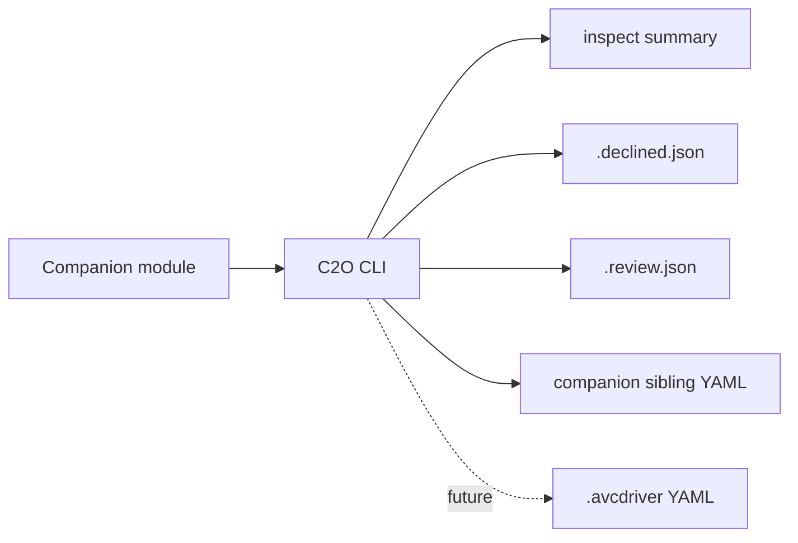

# Companion-2-OpenAVC (C2O)

Convert Bitfocus Companion modules into OpenAVC YAML driver definitions.

C2O is a static translator. It reads Companion module source, extracts the parts that can be represented declaratively, and reports anything that still needs human review. It does not execute the Companion module and it never generates OpenAVC Python drivers.

## Status

C2O is in active development. Milestones M1-M22 have landed source resolution, the YAML suitability gate, static extractors, inspection, upstream validation, logging, strict/lenient review modes, and Companion sibling artefacts.

The primary `.avcdriver` YAML emitter has not landed yet. Today, `c2o convert` runs the conversion pipeline and writes supported report artefacts:

- `.declined.json` for modules that are not suitable for declarative YAML.
- `.review.json` in lenient mode for eligible modules with review flags.
- `.companion-feedbacks.yml` and `.companion-presets.yml` for informational Companion UI artefacts.

Use `c2o inspect` to preview extraction results and `c2o validate` to check existing `.avcdriver` files against the vendored upstream validator.

## Source Of Truth

The canonical OpenAVC driver contract is upstream:

- [open-avc/openavc-drivers/AGENTS.md](https://github.com/open-avc/openavc-drivers/blob/main/AGENTS.md) - prose schema, enums, repository conventions, and validation rules.
- [open-avc/openavc-drivers/scripts/build_index.py](https://github.com/open-avc/openavc-drivers/blob/main/scripts/build_index.py) - authoritative validator, vendored in this repo.

C2O does not maintain a parallel schema. The historical scratchpad [`docs/legacy/avcdriverbreakdown.avcdriver`](docs/legacy/avcdriverbreakdown.avcdriver) is retained only for reference and is superseded by upstream AGENTS.md.

Detailed Companion -> OpenAVC mapping rules live in [`memory-bank/projectbrief.md`](memory-bank/projectbrief.md) section 15.

## How It Works



Modules that require UDP, binary framing, custom authentication, or another Python-driver-only capability are declined with exit code 2 and a `.declined.json` report.

## Install

Requirements: Python 3.12 or newer and [uv](https://docs.astral.sh/uv/getting-started/installation/).

```bash
uv sync --all-extras
uv run c2o --help
```

## CLI

Root logging options go before the subcommand:

```bash
uv run c2o -v inspect bmd-webpresenter
uv run c2o -vv --log-format json inspect bmd-webpresenter
```

### Inspect

Read-only suitability and extraction summary:

```bash
uv run c2o inspect ./companion-module-bmd-webpresenter
uv run c2o inspect bmd-webpresenter --keep-temp
```

`inspect` shows eligibility first, then section summaries and review-flag counts for eligible modules.

### Convert

Run the conversion pipeline and write supported sidecar/sibling artefacts:

```bash
uv run c2o convert ./companion-module-bmd-webpresenter -o out/bmd-webpresenter.avcdriver
uv run c2o convert bmd-webpresenter -o out/bmd-webpresenter.avcdriver --lenient
uv run c2o convert bmd-webpresenter -o out/bmd-webpresenter.avcdriver --interactive
```

Important flags:

- `-o, --output PATH` - required output path. The stem determines sidecar/sibling filenames.
- `--strict` - default policy; unresolved review flags exit 1.
- `--lenient`, `-l` - eligible modules with review flags exit 0 and write `.review.json`.
- `--interactive/--no-interactive` - prompt for metadata C2O cannot safely infer.
- `--keep-temp` - preserve remote clone tempdirs for debugging.

`convert` does not write the primary `.avcdriver` file yet.

### Validate

Validate an existing `.avcdriver` with the vendored upstream validator:

```bash
uv run c2o validate ./drivers/generic/example.avcdriver
```

### Version

```bash
uv run c2o version
```

## Exit Codes

| Code | Meaning |
| --- | --- |
| 0 | Success, including lenient eligible conversions with `.review.json`. |
| 1 | Strict review failure, validation failure, or general input/runtime failure. |
| 2 | YAML suitability decline. `--lenient` does not override a decline. |

## Artefacts

| File | When written | Purpose |
| --- | --- | --- |
| `<stem>.declined.json` | Declined module | Machine-readable suitability blockers. |
| `<stem>.review.json` | Eligible module with review flags in lenient mode | Machine-readable review flags. |
| `<stem>.companion-feedbacks.yml` | Eligible module with feedback definitions | Informational Companion feedback preservation. |
| `<stem>.companion-presets.yml` | Eligible module with preset definitions | Informational Companion preset preservation. |

Sibling YAML files are not part of the OpenAVC catalog and are ignored by `build_index.py`.

## Development

```bash
uv sync --all-extras
uv run pytest
uv run ruff check .
uv run isort --check c2o tests
uv run black --check c2o tests
uv run mypy c2o tests
make quality
uv build
```

Docs and upstream snapshot:

```bash
uv run mkdocs serve
make docs-build
make update-upstream
```

Agent-oriented guidance lives in [`AGENTS.md`](AGENTS.md). Contributor documentation lives in [`docs/contributor-guide.md`](docs/contributor-guide.md).

## Reference Fixture

[`tests/fixtures/external/bmd-webpresenter/`](tests/fixtures/external/bmd-webpresenter/) is the primary real-world fixture. It covers a TCP Companion module with newline-delimited responses, string-template commands, state variables, polling, feedbacks, and presets.

## Repository Layout

```text
.
├── c2o/                    # Python package: CLI, parser, extractors, emitters
│   └── vendored/           # pinned openavc-drivers snapshot
├── docs/                   # MkDocs site
├── memory-bank/            # project brief, active context, milestone archives
├── tests/                  # pytest suite + fixtures
│   └── fixtures/external/  # real-world Companion modules
├── AGENTS.md
├── mkdocs.yml
├── pyproject.toml
└── README.md
```

## Resources

- OpenAVC: [docs.openavc.com](https://docs.openavc.com/) - [github.com/open-avc/openavc](https://github.com/open-avc/openavc)
- OpenAVC drivers: [github.com/open-avc/openavc-drivers](https://github.com/open-avc/openavc-drivers)
- Companion: [bitfocus.io/companion](https://bitfocus.io/companion) - [github.com/bitfocus/companion](https://github.com/bitfocus/companion)

## License

MIT - see [`LICENSE`](LICENSE).
