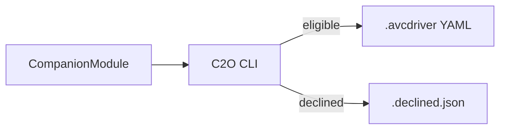

# Companion-2-OpenAVC (C2O)

Convert **Bitfocus Companion** modules into **OpenAVC** `.avcdriver` YAML driver definitions.

## Status

**M0 bootstrap complete.** The Typer CLI is wired with stub subcommands; extractors and conversion logic land in milestones M1–M24.

C2O emits **YAML only**. When a module is too complex for declarative YAML (UDP, binary framing, custom auth, etc.), C2O **declines** and writes a `.declined.json` report (exit code 2).

## What & why

Bitfocus Companion modules are imperative Node.js packages. OpenAVC drivers are declarative YAML interpreted at runtime. C2O lifts the intent of a Companion module — metadata, config schema, commands, response parsing, polling — into a structured driver file without executing the source module.

## Source of truth

The canonical OpenAVC driver spec is upstream:

- **[open-avc/openavc-drivers/AGENTS.md](https://github.com/open-avc/openavc-drivers/blob/main/AGENTS.md)** — schema, enums, validation rules
- **[scripts/build_index.py](https://github.com/open-avc/openavc-drivers/blob/main/scripts/build_index.py)** — authoritative validator (vendored in this repo)

The historical scratchpad [`docs/legacy/avcdriverbreakdown.avcdriver`](docs/legacy/avcdriverbreakdown.avcdriver) predates upstream discovery and is **superseded** by AGENTS.md.

Detailed mapping rules: [`memory-bank/projectbrief.md`](memory-bank/projectbrief.md) section 15.

## How it works



## CLI

```bash
uv sync --all-extras
uv run c2o --help
```

Subcommands: `convert`, `inspect`, `validate`, `version` (stubs until later milestones).

```bash
c2o convert ./companion-module-bmd-webpresenter -o out.avcdriver
c2o inspect bmd-webpresenter
c2o validate ./driver.avcdriver
c2o version
```

## Development

Requirements: Python **>= 3.12**, [uv](https://docs.astral.sh/uv/getting-started/installation/).

```bash
uv sync --all-extras
uv run c2o --help
uv run pytest
uv run ruff check .
uv run mypy c2o
uv build
make update-upstream    # refresh vendored openavc-drivers snapshot
uv run mkdocs serve     # docs preview
```

See [`AGENTS.md`](AGENTS.md) for agent-oriented guidance.

## Reference example

[`tests/fixtures/external/bmd-webpresenter/`](tests/fixtures/external/bmd-webpresenter/) — TCP module with newline-delimited responses, string-template commands, and polling. Used as a real-world fixture from M3 onward.

## Repository layout

```text
.
├── c2o/                    # Python package (CLI + extractors)
│   └── vendored/           # pinned openavc-drivers snapshot
├── docs/                   # MkDocs site
├── tests/                  # pytest suite + fixtures
│   └── fixtures/external/  # real-world Companion modules (e.g. bmd-webpresenter)
├── AGENTS.md
├── pyproject.toml
└── README.md
```

## Resources

- OpenAVC: [docs.openavc.com](https://docs.openavc.com/) · [github.com/open-avc/openavc](https://github.com/open-avc/openavc)
- Companion: [bitfocus.io/companion](https://bitfocus.io/companion) · [github.com/bitfocus/companion](https://github.com/bitfocus/companion)

## License

MIT — see [`LICENSE`](LICENSE).
