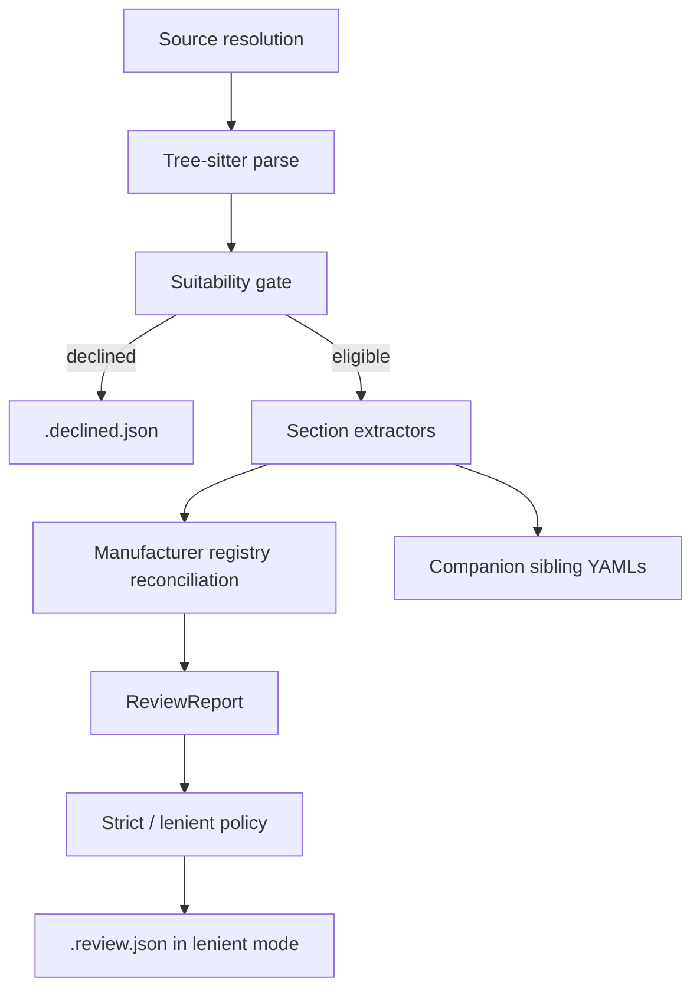

# Contributor Guide

This page is for contributors working on C2O itself. User-facing CLI usage lives in the [User Guide](user-guide.md).

## Source Documents

Project architecture, milestones, and Companion -> OpenAVC mapping rules live in the repository's [project brief](https://github.com/Capp3/companion-2-openavc/blob/main/memory-bank/projectbrief.md). The brief stays in `memory-bank/`; it is linked from this site, not republished here.

AI coding agents should also read [`AGENTS.md`](https://github.com/Capp3/companion-2-openavc/blob/main/AGENTS.md) at the repository root.

## Architecture

The conversion pipeline is intentionally static. C2O reads Companion source files; it does not execute the module.



Important packages:

| Path | Purpose |
| --- | --- |
| `c2o/source/` | Local, GitHub URL, and bare module-ID source resolution. |
| `c2o/parse/` | Tree-sitter setup and JavaScript literal/template helpers. |
| `c2o/suitability/` | YAML suitability gate and blocker catalogue. |
| `c2o/extract/` | Static extractors for each driver section or sibling artefact. |
| `c2o/model/` | Pydantic models for extracted sections and review reports. |
| `c2o/emit/` | Decline, review, and sibling artefact writers. |
| `c2o/registry/` | OpenAVC manufacturer registry reconciliation. |
| `c2o/validate/` | Vendored upstream validator wrapper. |
| `c2o/vendored/openavc_drivers/` | Pinned snapshot of upstream OpenAVC driver tooling/schema. |

## Extractor Authoring

Extractors should be conservative and deterministic:

- Prefer existing parse helpers before adding new tree-sitter traversal logic.
- Decode only what can be proven statically.
- Emit `ReviewFlag`s for lossy or confidence-limited conversions that should block strict mode.
- Do not add new `ReviewCode` values without updating the review-code catalogue test.
- Keep generated output stable: no timestamps, host paths, network timing, or source-order ambiguity unless intentionally documented.
- Cover each extractor with focused unit tests plus integration/golden tests when it changes CLI output.

For partially dynamic JavaScript objects, prefer selective field decoding over whole-object decoding. This keeps static data usable even when a callback or helper call is intentionally skipped.

## Development Setup

```bash
uv sync --all-extras
uv run c2o --help
```

Quality commands:

```bash
uv run pytest
uv run ruff check .
uv run isort --check c2o tests
uv run black --check c2o tests
uv run mypy c2o tests
make quality
```

Docs commands:

```bash
uv run mkdocs serve
make docs-build
```

`make docs-build` runs `mkdocs build --strict`, matching the docs CI gate.

## Refresh Upstream

```bash
make update-upstream
```

This refreshes the vendored `open-avc/openavc-drivers` snapshot under `c2o/vendored/openavc_drivers/`. After updating upstream, re-run quality gates and re-check any emitted fields against the [Field Reference](field-reference.md).

## Pull Request Checklist

- The change is scoped to the relevant milestone or issue.
- Existing user changes are preserved.
- New behaviour has tests at the right level.
- `make quality` passes.
- `make docs-build` passes for documentation changes.
- New emitted OpenAVC fields are backed by upstream AGENTS.md or schema, not local invention.
